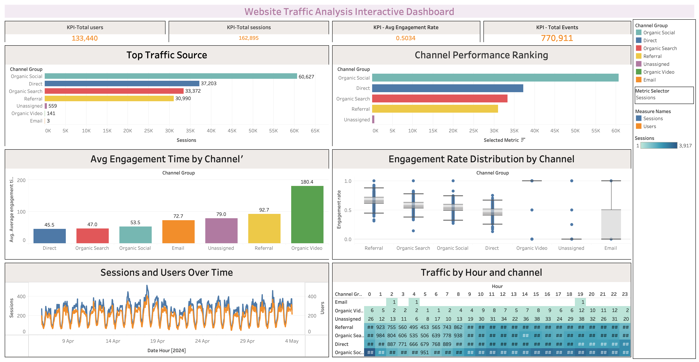

# Syntecxhub Website Traffic Analysis

## Overview
This project analyzes website traffic data to uncover trends, user behavior patterns, and key performance insights. Completed as part of a Data Analyst Internship at Syntecxhub, it demonstrates an end-to-end analytics workflow — from raw data cleaning to visualization.

## Objectives
- Clean and preprocess raw website traffic data
- Perform exploratory data analysis (EDA) to identify trends and patterns
- Build an interactive dashboard to visualize key traffic metrics
- Translate data findings into actionable insights

## Tools & Technologies
- **Python** (Pandas, NumPy) — data cleaning and preprocessing
- **Jupyter Notebook** — analysis and exploration
- **Tableau** — interactive dashboard creation

## Project Structure
- `Syntecxhub_Website_traffic_analysis.ipynb` — main analysis notebook (data cleaning, EDA)
- `Raw_website_traffic.csv` — raw website traffic dataset
- `website_traffic_cleaned.csv` — cleaned dataset ready for analysis/visualization
- `Syntecxhub_website_analysis_dashboard.png` — dashboard screenshot

## Dashboard Preview

## How to Run
1. Clone this repository
2. Open `Syntecxhub_Website_traffic_analysis.ipynb` in Jupyter Notebook
3. Run all cells to reproduce the analysis

## Author
[Subhash Chandar] — Data Analyst Intern at Syntecxhub
